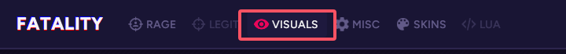
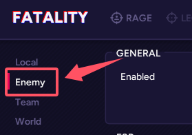
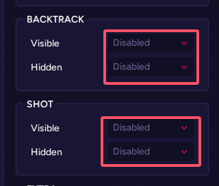

# Fatality进服崩溃解决方法

## 资源加载崩溃
目前，当游戏注入Fatality后尝试加载服务器自定义资源时，会出现崩溃的问题。
为了避免这种情况，您可以尝试以下解决方案：

1. 进入服务器后，在游戏内注入Fatality。(推荐)
2. 进入服务器后，此时已经完成加载资源，可以断开服务器连接后注入Fatality，再进入服务器。

## 开枪打模型崩溃
目前Fatality的Shot上色和Backtrack上色并不支持第三方模型。
因此您需要手动关闭这两个功能。

以下是如何关闭这两个功能的详细步骤。

1. 在Fatality菜单中，点击 *VISUALS* 选项卡。

    
2. 点击左侧的 *Enemy* 选项卡。

    
3. 将 *SHOT* 和 *BACKTRACK* 部分的所有选项修改为 *Disabled*。

    