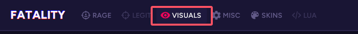
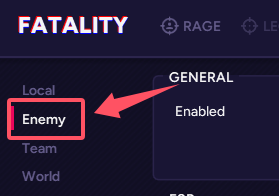
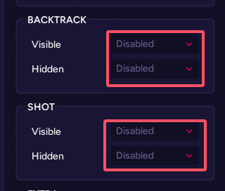
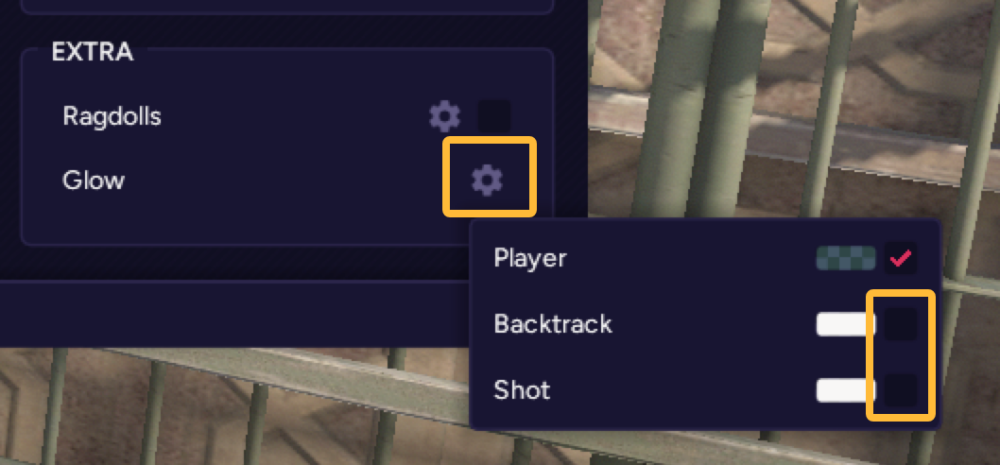

# Fatality进服崩溃解决方法

## 开枪打模型崩溃
目前Fatality的Shot上色和Backtrack上色并不支持第三方模型。
因此您需要手动关闭这两个功能。

以下是如何关闭这两个功能的详细步骤。

1. 在Fatality菜单中，点击 *VISUALS* 选项卡。

    

2. 点击左侧的 *Enemy* 选项卡。

    

3. 将 *SHOT* 和 *BACKTRACK* 部分的所有选项修改为 *Disabled*。

    

4. 将 *Chams的 *Shot* 和 *Backtrack* 部分也关闭掉。

   
5. 