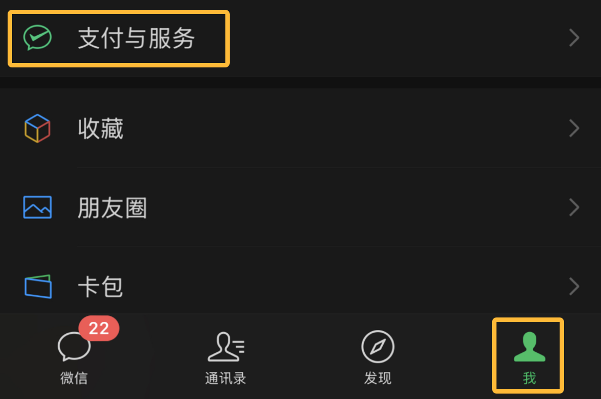
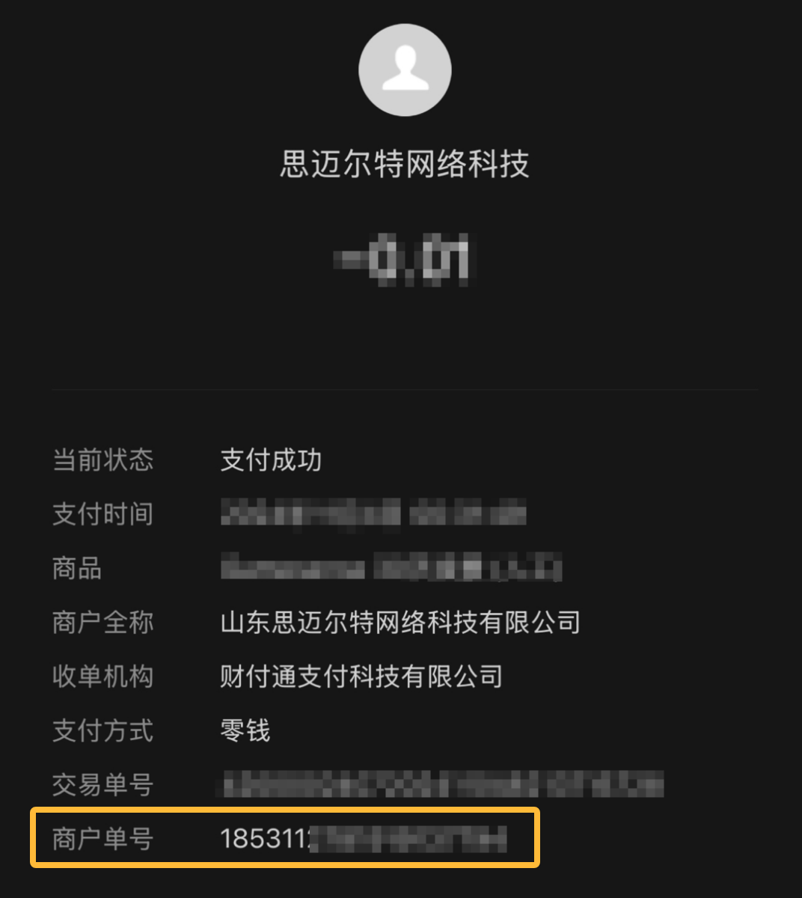
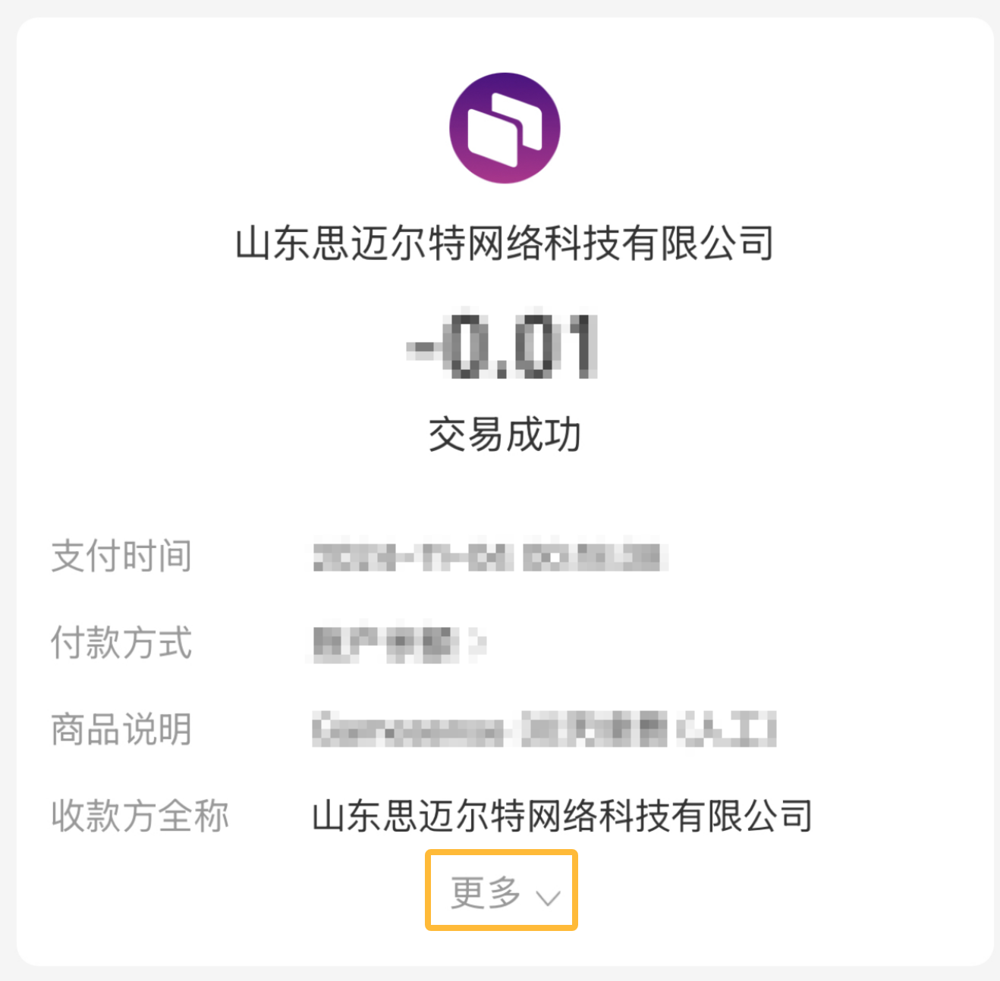
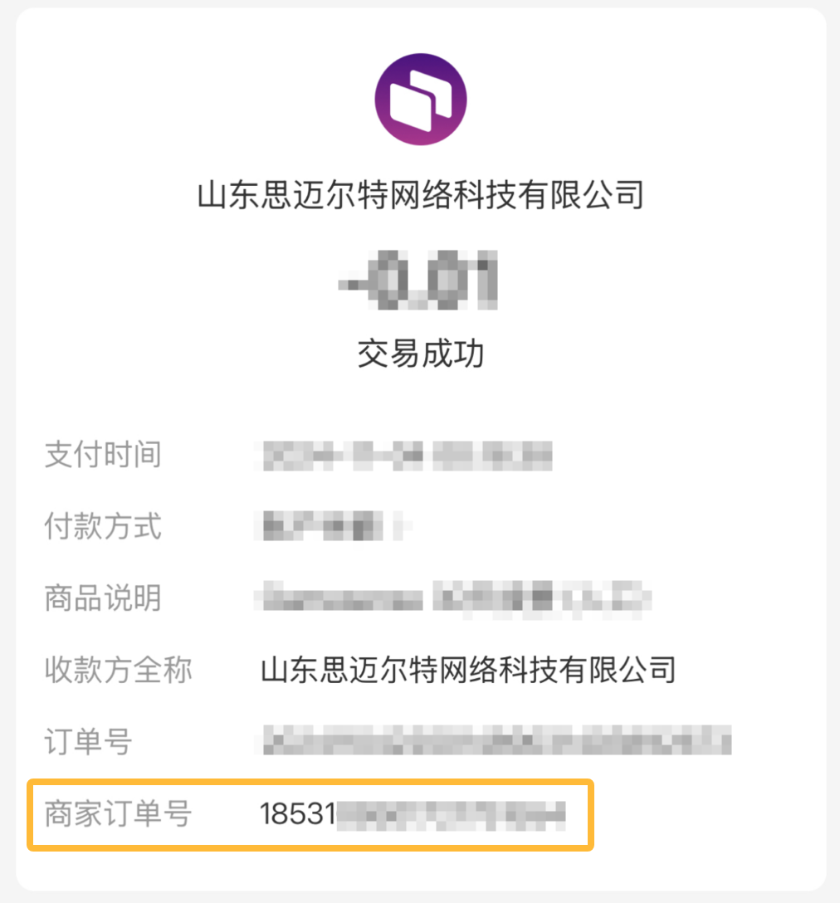
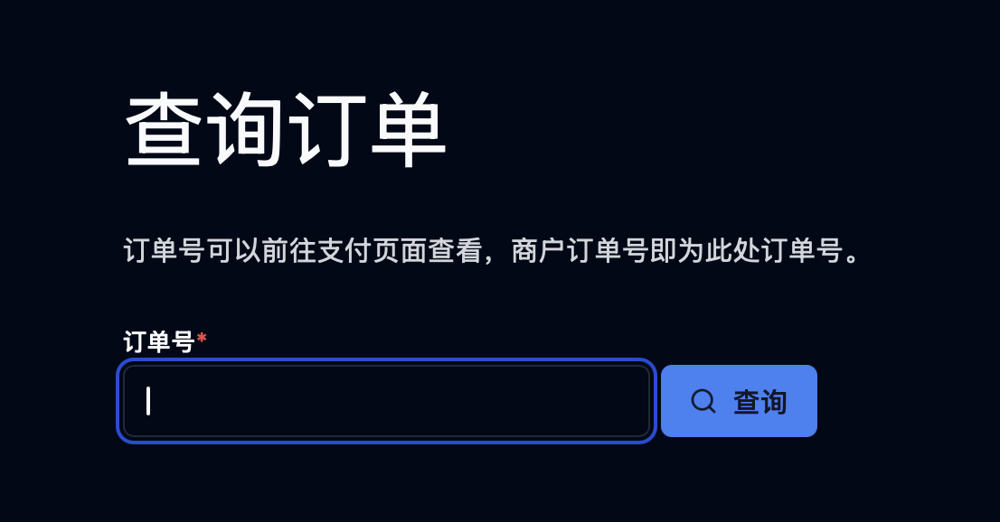

# 忘记订单号了怎么办？

## 找回订单号
### 微信支付
在微信中，您可以通过以下方式找回订单号：

- 打开微信，点击右下角的 *我*，选择 *支付与服务* -> *钱包* -> *账单*

- 找到您的订单，点击进入订单详情，此处的商户单号即为您的订单号。

### 支付宝
在支付宝中，您可以通过以下方式找回订单号：

- 打开支付宝，点击右下角的 *我的* -> *账单*
- 找到您的订单，点击进入订单详情，您可能需要点击 *更多* 才能显示订单号。

- 此处的商家订单号即为您的订单号。

## 查询订单
您可以通过以下链接查询您的订单：
[https://cshvh.cn/renewal/search-order](https://cshvh.cn/renewal/search-order)

输入您的订单号，点击 *查询* 即可查看您的订单信息。