# 服务器内模型不能正常显示的解决方法

## Gamesense
关闭库存修改器中的探员覆盖即可，部分情况下可能需要重启游戏或者在官网中重新修改模型才能生效。

1. 点击菜单左侧的 *爪子刀* 图标。

   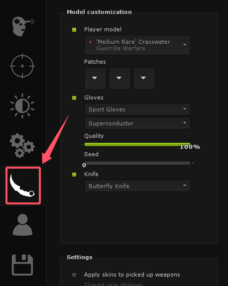

2. 关闭 *Player model* 和 *Gloves*。

   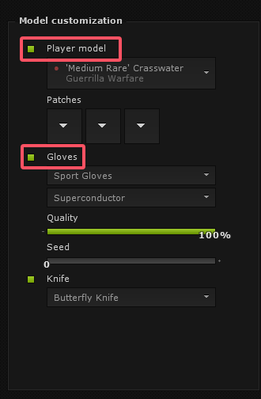

3. 通常来说，已经可以正常显示模型了。如果还是无法显示，请尝试重启游戏。

## Neverlose
需要关闭库存修改器中的修改探员，将探员修改为默认探员。

1. 点击左侧的 *Skinchanger* 选项卡。

    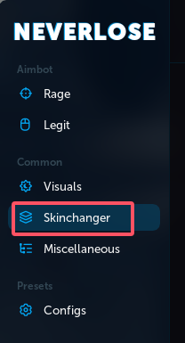

2. 在上方选项卡中，选择 *T Skins*。

    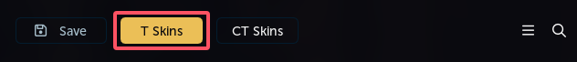

3. 将菜单翻到最下方，找到探员修改器部分（可能与图片中不相符，但是是一个人物的图标）

    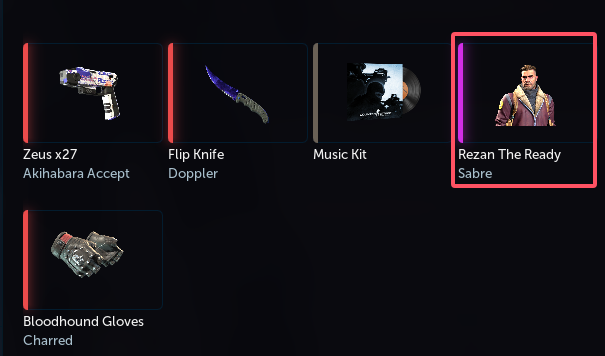

4. 选择默认T探员。

    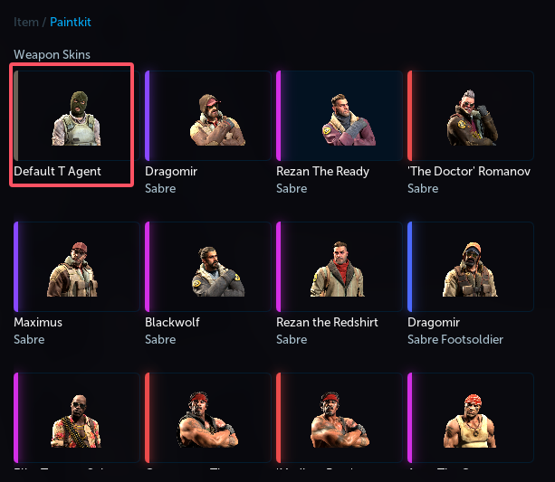

5. 直接点击右下角Save按钮保存T探员设置。

    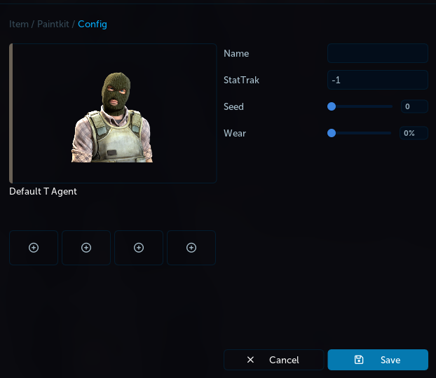

6. 找到手套修改器部分。

    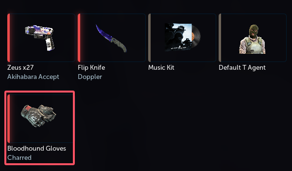

7. 选择默认手套。

    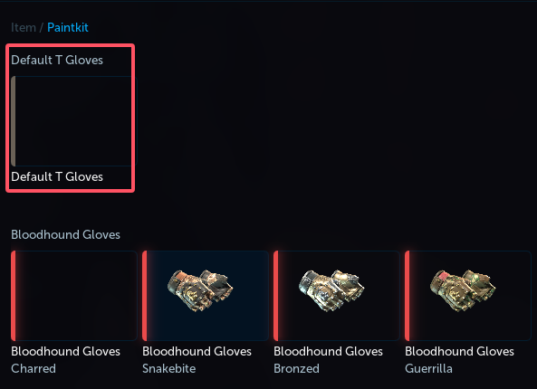

8. 在上方选项卡中，选择 *CT Skins*。

    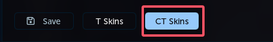

9. 重复步骤3-7，选择默认CT探员和手套。
10. 点击左上角的 *Save* 按钮保存设置。
    
    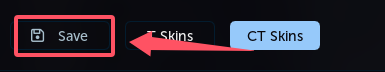

11. 重启游戏！

修改后需要*重新启动游戏*才能生效！

## Fatality
关闭修改探员和修改手套即可。

1. 点击上方的 *SKINS* 选项卡。
2. 在右侧的 *INVENTORY* 中，将带有 *GLOVES* 和 *| (一个竖岗)* 的选项全部关闭。
3. 点击 *Reload* 重载设置。

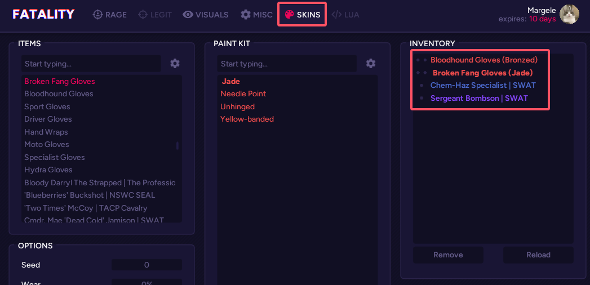

如果以上步骤无法解决问题，请保存参数后尝试重启游戏。