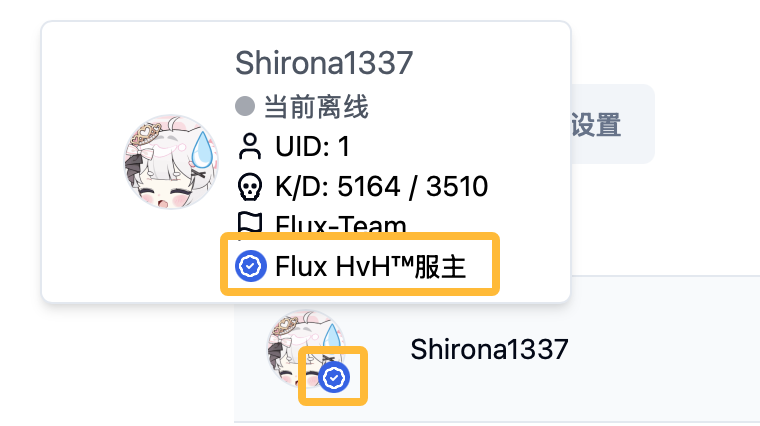

# Flux HvH™官方认证须知

Flux HvH™认证机制是为辨别部分用户可能遭遇高仿账号或者其他容易造成混淆的情况而设立的。
我们希望能够通过该机制，尽量减少可能出现高仿账号对其他用户造成的困扰。

## 认证后预览

## 认证过程

认证前您需要注意，该认证机制较为苛刻，并且不会大量发送认证标识。请您在认证前确保您已经满足认证条件。

1. 您需要确保您已经注册了Flux HvH™账号，并且自己满足下列条件中的任意一条。
2. 添加QQ 3004233621，并发送您的认证材料和Flux HvH™用户ID。
3. 等待Flux HvH™管理员审核，审核通过后您将会在24小时内收到认证标识。

## 认证条件

您至少需要满足以下条件中的一条：

- Flux HvH™社区合作伙伴。
- 在Flux HvH™社区内的活跃用户。

    此认证条件相对来说比较主观，通常需要在历史或当前排行榜前10，并曾对服务器建设发展提出过合理的宝贵意见或者曾进行过问题反馈。且当您不再活跃时，认证标识将可能被取消。

- 在其他知名社区中承担管理员或版主角色。
- 在HvH社区中拥有良好口碑的商家。

    如果您在社区内出售参数、脚本等商品，且较为知名，您可以通过该条件获得认证标识。

- 知名战队队长。

    如果您曾经在Flux HvH™社区进行过中介或者其他合作，您可以通过该条件获得认证标识。并且在您获得战队创始人认证后，您可以添加您战队中所有成员 (小于8个) 作为认证用户。

- 其他情况。

    如果您认为自己在HvH社区内较为知名，您可以提供相关佐证材料，我们将会进行审核。

以上所有认证都包含主观因素，Flux HvH™保留最终解释权。