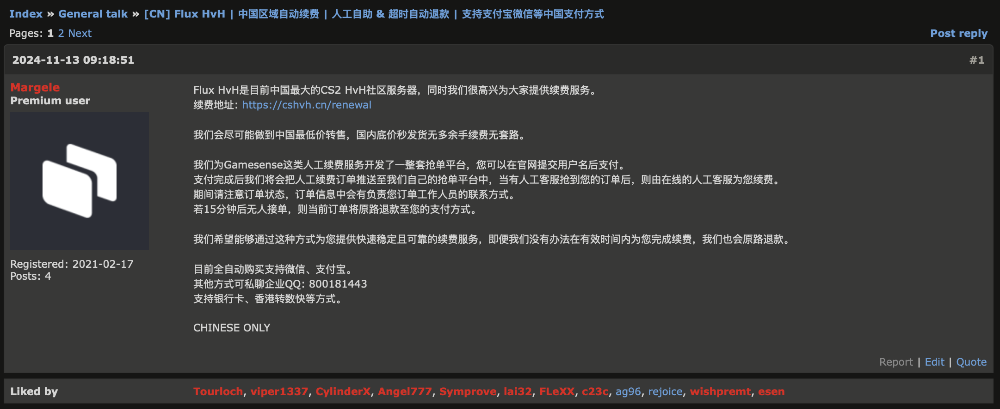

# Gamesense付款前须知

感谢您选择信任Flux HvH™！

## Flux HvH™介绍

Flux HvH™是一个专注于提供高质量游戏体验的社区，我们的目标是为您提供最好的游戏体验的同时为您提供尽可能低的续费价格。

目前，Flux HvH™是Gamesense的官方合作伙伴。我们不仅提供邀请服务，也同时提供Gamesense的官方续费服务。

[官方续费帖](https://gamesense.pub/forums/viewtopic.php?id=45009)

## Gamesense价格 & 套餐

| 邀请码           | 捆绑参数                                                                      | 价格   |
|---------------|---------------------------------------------------------------------------|------|
| Gamesense论坛邀请 | 无参数套餐                                                                     | 2550 |
| Gamesense论坛邀请 | [82Lab Small8参数](https://www.yuque.com/u39580238/xa7g58/pratlhr3291u41qi) | 2850 |
| Gamesense论坛邀请 | [82Lab Yuk9参数](https://www.yuque.com/u46499497/qaz9l1/xlyfo05ig8egh2l3)   | 2750 |

以上捆绑包含了Gamesense论坛邀请码和对应的参数，您可以根据自己的需求选择不同的套餐。

我们不再提供捆绑的续费服务，您可以在我们的官网上选择对应的续费服务。
您可以在这里查看[续费教程](../guides/manual-renewal-guide.md)。

## 购买前须知

- 您必须保证购买后不会要求退款。
- 您必须保证是为自己购买，而不是为他人购买。
- 您必须保证使用地区为中国大陆，否则账号可能会遭到封禁。地区判断与VPN或加速器无关，您不会因为VPN或者加速器而被封禁。
- 如果您需要在其他地区使用Gamesense，请咨询客服。
- Gamesense无法更换邮箱，而且严格禁止账号交易。

## 支付方式
请联系客服获取支付方式。

通常我们支持支付宝、微信、银行卡等支付方式。
但我们也同时支持其他支付方式，如香港转数快等，具体请咨询客服。

## 常见问题

### 1. Gamesense包含CS:GO和CS2吗？
包含。而且Gamesense订阅不分离，也就是说您购买Gamesense后可以同时使用CS:GO和CS2。

### 2. 我购买后多久可以收到邀请码？
通常会在24小时内收到邀请码，大多数情况下会在当天晚上收到。

### 3. 我购买后多久可以收到参数？
当您收到Gamesense账号后，我们会在账号发送给您的同时邀请您加入对应的参数群，群内会有详细的参数以及教程。

### 4. Gamesense可以重置机器码吗？
可以。Gamesense管理员会在您需要重置机器码时帮助您重置，您只需要回答对应的问题或提供相应的材料即可。
通常情况下，会要求你录制视频，先在老电脑上注入，然后再在新电脑上注入。或者提供其他证明。
同时我们也会帮助您完成解绑。

### 5. 拿到账号后，我应该在什么时候续费？
我们建议您在拿到账号后立即续费，以免账号被封禁。实际上我们这里也有3天后才续费的客户，但是我们不建议这样做。

### 6. Gamesense可以裸连注入吗？
在大部分地区可以，但是可能在部分地区无法裸连注入。如果不能裸连注入，您可以尝试使用加速器。
Gamesense不会因为您使用加速器而被判定为共享账号，导致账号被封禁。