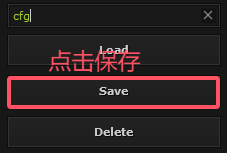

# Gamesense常见问题

## 怎么下载注入器？
1. 登录论坛后，点击上方的红色 *Premium* 按钮进入菜单。

   如果您找不到该按钮，那么说明您有可能没有有效的续费，请参考[人工自动续费教程](../guides/manual-renewal-guide.md)完成续费。
   

2. 在下方菜单中找到 *Download latest client* 按钮，点击下载注入器。

   请注意，您如果您需要下载CS2的注入器，请点击 *Download CS2* 按钮。如果您需要下载CS:GO的注入器，请点击 *Download CS:GO* 按钮。它们的注入器并不通用。
   

   下载前请确保您的下载插件已经关闭(例如IDM、迅雷等)，否则可能会导致下载失败。Skeet注入器在5分钟内只能下载一次，如果本次下载失败，请等待5分钟后再次尝试。

3. 下载注入器后，打开注入器，第一次登录可能需要输入用户名和密码。
4. 当出现注入窗口时，点击Load完成注入。

5. Skeet不会自动启动Steam和游戏，您需要手动启动CS2游戏。
6. 当游戏出现卡顿时，则说明Skeet开始注入了，稍后您将会看到Skeet菜单。

## 登录时提示Please prove that you are human或请证明您是人类
这是由于您没有完成Gamesense论坛的验证码导致的。

如果如下图所示，说明验证码加载正常，请完成验证码。

如果没有出现验证码，说明您的网络环境可能存在问题，您可以尝试使用加速器解决该问题。

## 登录时提示2FA Code或两步验证等问题
如果您没有开启两步验证，但是登录时提示需要输入2FA Code，那么此时验证码应应该已经被发送至您的邮箱。
请查看邮箱中的验证码，输入验证码即可登录。

如果收件箱中没有验证码，那么请检查垃圾箱或者其他文件夹，有时候验证码会被误判为垃圾邮件。

如果您已经开启了二步验证，那么请查看您的手机或者其他设备上的验证码，输入验证码即可登录。

## 怎么找回密码？
您可以通过以下步骤找回密码：

[找回密码](https://gamesense.pub/forums/login.php?action=forget)

进入该页面后，输入您注册Gamesense使用的邮箱，完成验证码后，您将会收到一个带有新密码的邮件。按照新密码登录即可。

如果收件箱中没有验证码，那么请检查垃圾箱或者其他文件夹，有时候验证码会被误判为垃圾邮件。

## 怎么修改密码？
您可以通过以下步骤修改密码：
1. 在登录后，点击上方的 *Profile* 按钮。

2. 找到 *Change Password* 按钮，点击进入修改密码页面。

3. 在新的页面中，在上方输入您的旧密码，下方输入新密码和确认密码，点击 *Change Password* 按钮即可完成密码修改。


请注意，密码最短为6位，且区分大小写。

## 注入时出现Disable KVA shadowing and try again弹窗

这是由于您的电脑没有关闭KVA Shadowing导致的，您可以通过以下步骤关闭KVA Shadowing：

1. 右键Windows的开始按钮，选择 *终端 (管理员)* 或 *Windows PowerShell (管理员)* 或 *命令提示符 (管理员)*
2. 在弹出的窗口中输入以下命令(您可以复制后在窗口右键粘贴)，然后按回车键：
    ```shell
    reg add "HKEY_LOCAL_MACHINE\SYSTEM\CurrentControlSet\Control\Session Manager\Memory Management" /v FeatureSettingsOverride /t REG_DWORD /d 3 /f
    reg add "HKEY_LOCAL_MACHINE\SYSTEM\CurrentControlSet\Control\Session Manager\Memory Management" /v FeatureSettingsOverrideMask /t REG_DWORD /d 3 /f
    ```
3. 当您看到**两个** *操作成功完成* 字样时，重启电脑。
4. 尝试注入Skeet。

## 如何加载参数

1. 首先找到您需要加载的参数，被保存好的参数通常是一个TXT文件。
2. 用记事本或者其他文本编辑器，打开这个TXT文件，全选后复制。

   
   
3. 在Skeet菜单中选择左侧 *保存* 按钮，点击进入。

   
4. 点击 *Import from clipboard* 按钮，此时参数应该会被加载。

   
5. 在此输入框中输入您要被保存的参数名称。

   
6. 点击 *Save* 按钮保存参数。

   
7. 如果下次注入时需要加载本参数，只需要在上方点击上次您输入的参数名称后点击 *Load* 按钮保存即可。
   
   

## 在论坛中提示我已经被封禁怎么办？
通常情况下，如果此时您还能够显示账号订阅，那么此时您应该是由于加速器IP被封禁导致的。这种情况下您只需要关闭加速器或者尝试更换加速器节点即可解决。

如果此时您已经无法显示账号订阅，并且您确定自己此时有订阅，并且已经关闭加速器或尝试更换加速器无果，那么您的账号可能已经被封禁。请联系我们的客服以获取帮助。

## 如何加入Gamesense的官方Discord？
您可以通过以下链接加入Gamesense的官方Discord：
[Gamesense官方Discord](https://gamesense.pub/forums/discord.php)

## 如何重置HWID (硬件码)？
首先，重置Gamesense的HWID是一件非常复杂的事情，以下我会分目前遇到的几种情况进行说明：

1. 在新电脑上注入，提示HWID错误。
2. 在论坛中选择 *Premium*。

3. 此时您应该可以看到有此输入框。输入框中填写您的重置理由，您可以参考我们提供的这些理由。

   - 重装系统: Reinstalled Windows
   - 更换主板: Changed motherboard
   - 更换CPU: Changed CPU
   - 更换主板和CPU: Changed motherboard and CPU
   - 更换硬盘: Changed hard disk
   - 更换显卡: Changed graphics card
   - 更换内存: Changed memory
   
   同时，还有可能会出现什么都没更换但是HWID被重置的情况，您可以使用：
   - 没有更换: Nothing changed

   
4. 提交后，等待Gamesense管理员审核，无论是请求被同意还是拒绝，您都不会收到通知。因此请在24小时后在新电脑尝试注入Gamesense。

### 情况1
在新电脑上尝试注入，如果成功，那么恭喜您完成了一次HWID重置。

### 情况2
您应该在期间留意论坛上的私信，可能会有Gamesense管理员发私信给你，要求你联系管理员。

通常会要求你加入Discord然后开一个关于HWID重置的工单，然后按照管理员的要求提供相关信息即可。


请注意: 所有Gamesense管理员的昵称都是绿色的，请不要相信任何其他颜色的人声称自己是管理员。

### 情况3
没有管理员联系您，而且在新电脑上依然无法注入，那么您的HWID重置请求被拒绝了。
您可以尝试加入Gamesense的Discord，然后在 #hwid-support-only 频道中开启一个新的工单。
