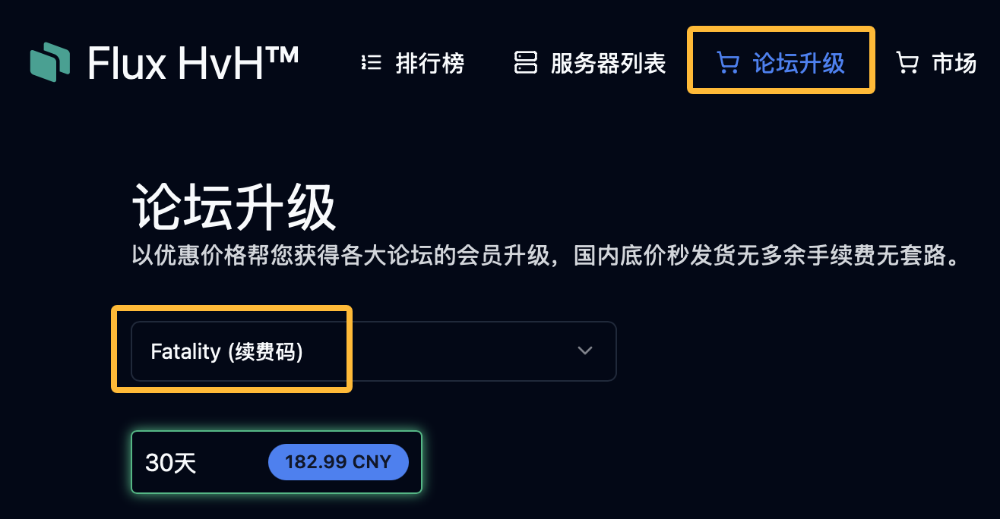
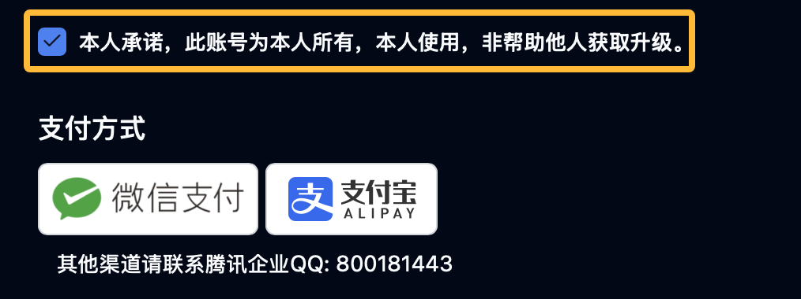
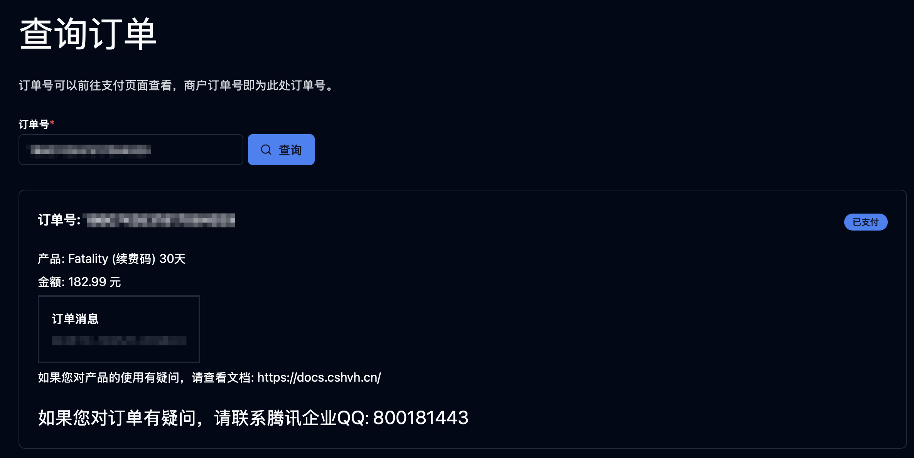
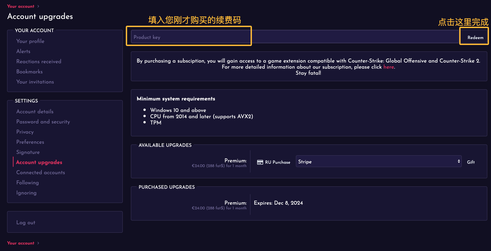
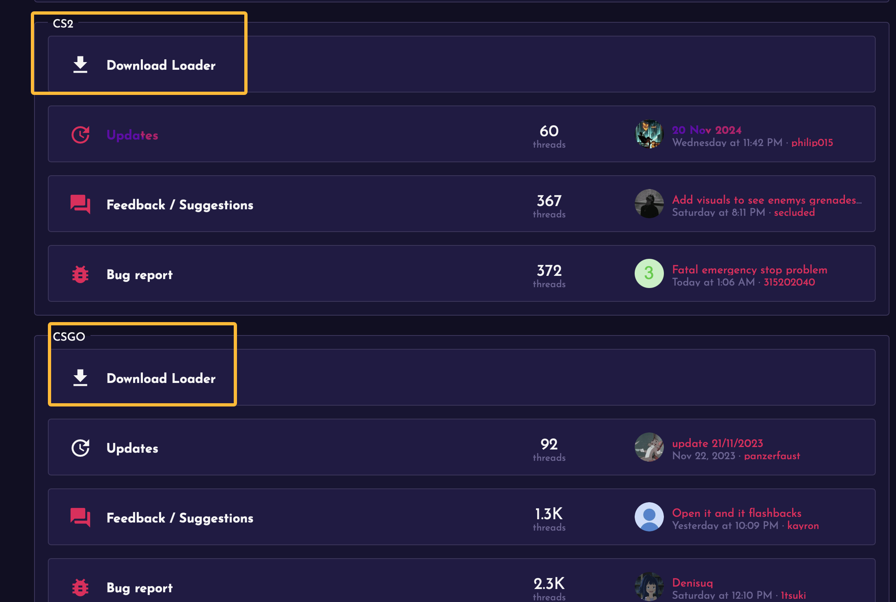
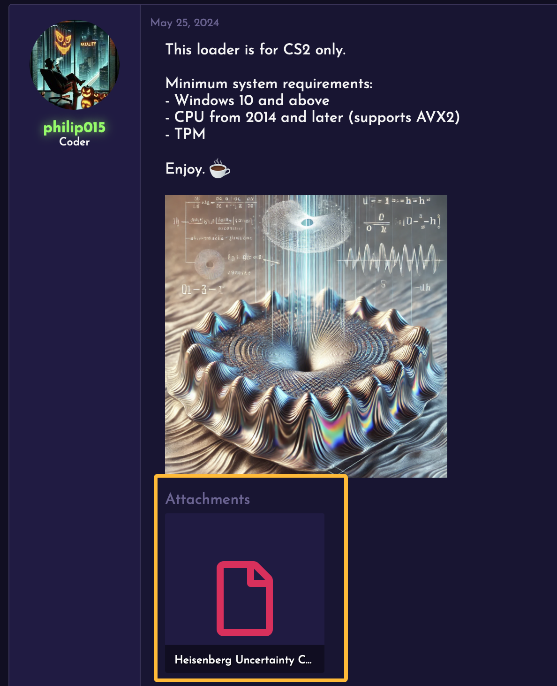

# Fatality续费教程

Fatality是一个邀请制的论坛，在购买前请务必确认您已经注册好了Fatality账号。
由于没有账号原因导致的无法激活，我们将不予以退款。

并且我们不出售邀请码。
请注意，邀请码买卖在Fatality论坛是被禁止的。

## 1. 在Flux HvH™官网购买产品密钥

您可以通过以下链接直接进入Flux HvH™官网续费页面：

[https://cshvh.cn/renewal](https://cshvh.cn/renewal)

在产品选择框中点击 **Fatality (续费码)** 选项，如下图所示：

勾选以下承诺框，然后点击您可以使用的付款方式，完成邀请码的购买。

支付完成后，您将收到产品密钥，请妥善保存。

---

## 2. 在Fatality论坛中激活订阅

前往以下链接进入Fatality续费页面：
[https://fatality.win/account/upgrades](https://fatality.win/account/upgrades)

您可能需要登录，登录后您将会看到如下页面。

您需要在标有 **Product key** 的输入框中输入您购买的产品密钥，然后点击 **Redeem** 按钮，如下图所示：

至此，您的Fatality已经激活。

---
## 3. 下载Loader
前往以下链接进入Fatality论坛页面：
[https://fatality.win](https://fatality.win)

如果您需要下载CS2的Loader，请点击CS2板块的Download Loader板块。
如果您需要下载CS:GO的Loader，请点击CS:GO板块的Download Loader板块。

跳转后您将看到如下页面，点击下面的附件即可下载Loader。

---

完成以上步骤后，您已成功续费并下载其注入器。
如果在操作过程中遇到问题，请联系支持团队以获取帮助！