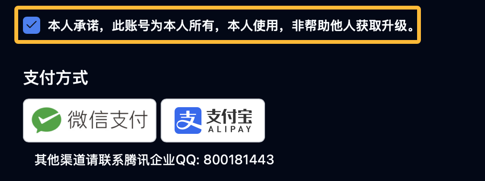

# 人工续费产品教程
目前，我们的Gamesense和CompKiller仍然没有办法实现自动续费。
但是我们在找Reseller进行人工续费时，经常会遇到付款后Reseller不在的情况。

因此我们开发了一套抢单平台，当支付完成后我们将会把人工续费订单推送至我们自己的抢单平台中。
当有人工客服抢到您的订单后，则由在线的人工客服为您续费。
期间请注意订单状态，订单信息中会有负责您订单工作人员的联系方式。

若15分钟后无人接单，则当前订单将原路退款至您的支付方式。

我们希望能够通过这种方式为您提供快速稳定且可靠的续费服务，即便我们没有办法在有效时间内为您完成续费，我们也会原路退款。

## 1. 选择需要续费的产品
您可以通过以下链接直接进入Flux HvH™官网续费页面：

[https://cshvh.cn/renewal](https://cshvh.cn/renewal)

在产品选择框中选择您要续费的产品，如下图所示：

勾选以下承诺框，然后点击您可以使用的付款方式，完成下单。

支付完成后，您将会被跳转至订单详情页面。
您可以点击 *查询* 按钮来刷新您的订单状态。

## 2. 等待人工续费
支付完成后，您的订单将会被推送至我们的抢单平台。
请耐心等待，我们的人工客服将会在15分钟内为您续费。

如果15分钟后无人接单，则当前订单将原路退款至您的支付方式。

## 3. 完成续费
当有人工客服接单后，您将会收到订单信息。
订单信息中会有负责您订单工作人员的联系方式。

## 意外情况
如果在操作过程中遇到问题，请联系优先联系负责您订单的QQ号！

其他支持，请联系我们团队以获取帮助！