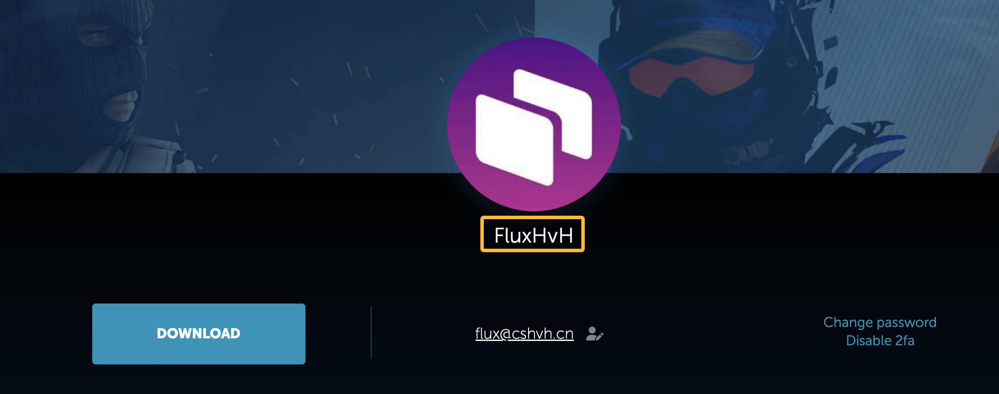
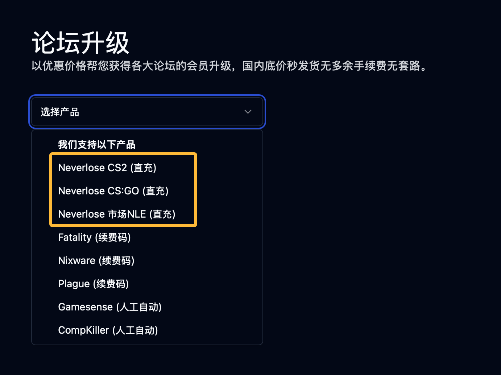
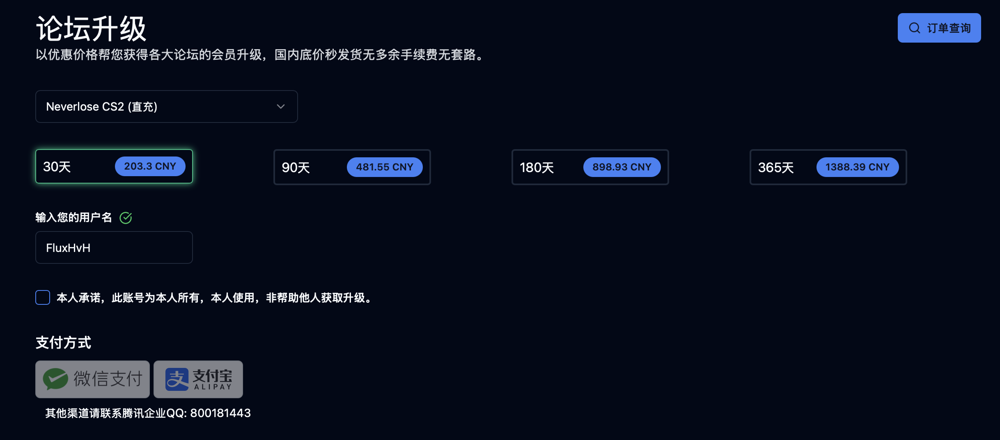
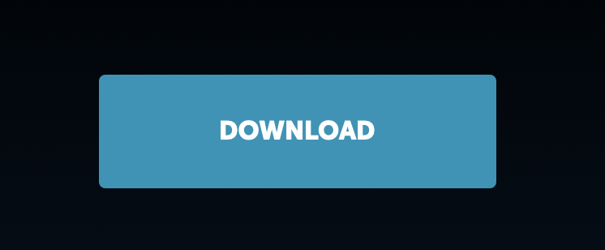

# Neverlose续费教程

## 1. 进入用户页面

首先，打开以下链接进入 Neverlose 用户页面：  
[https://en.neverlose.cc/me](https://en.neverlose.cc/me)

---

## 2. 找到您的用户名

进入页面后，您可以看到您的个人信息页面。您可以在这里找到您的用户名，如下图所示：

此处用户名为FluxHvH，请按照您的实际用户名进行操作。

***切记，您的用户名不是FluxHvH，而是您自己的用户名！请不要直接复制粘贴示例中的用户名。***

---

## 3. 选择需要续费的产品

前往以下链接选择您需要续费的游戏版本：  
[https://cshvh.cn/renewal](https://cshvh.cn/renewal)

在页面中，您会看到如下选项（见下图）：
- 如果您需要CS2的续费，请选择 **Neverlose CS2**。
- 如果您需要CS:GO的续费，请选择 **Neverlose CS:GO**。
- 如果您只需要NLE，请选择 **Neverlose 市场NLE**。

## 4. 填写用户名并选择支付方式

以续费*CS2*为例：

1. 选择您想要续费的天数（例如：30 天、90 天、180 天或 365 天）。
2. 在 **输入您的用户名** 框中，输入您获取到的用户名。
3. 等待网站验证您的用户名是否存在。
   - 如果显示 *无此用户名*，请重新确认您的用户名。
   - 如果有绿色对号显示，请继续下一步。
4. 选择您的支付方式完成支付。

支付后，您的续费应该已经完成。如果您的续费未完成，请联系支持团队以获取帮助。

---

## 5. 下载Loader

续费完成后，前往以下链接重新进入用户页面：  
[https://en.neverlose.cc/me](https://en.neverlose.cc/me)

找到页面中的 **Download** 按钮，点击下载 Loader，如下图所示：

---

完成以上步骤后，您已成功续费并下载其注入器。
如果在操作过程中遇到问题，请联系支持团队以获取帮助！