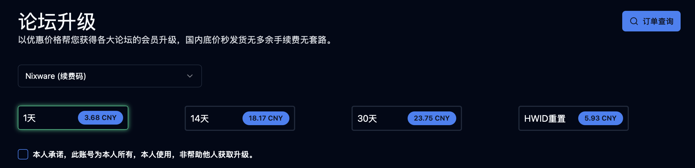
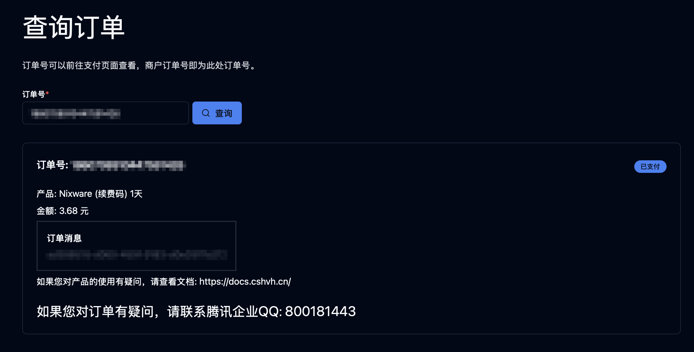
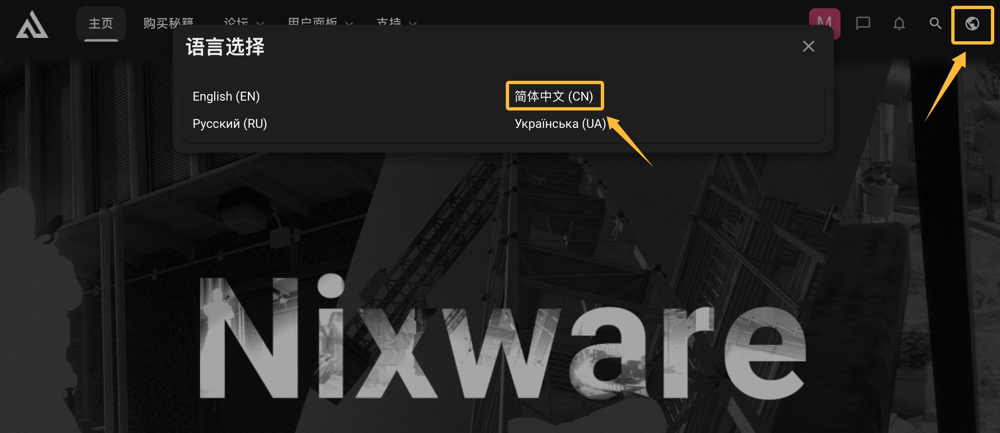
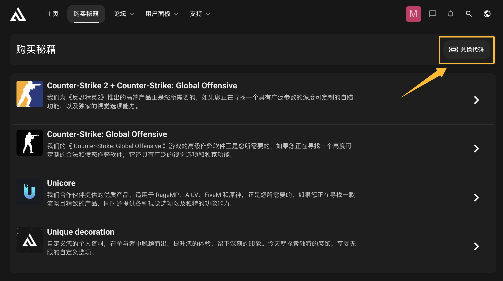
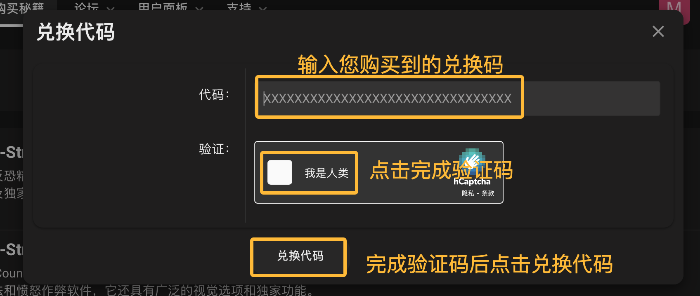
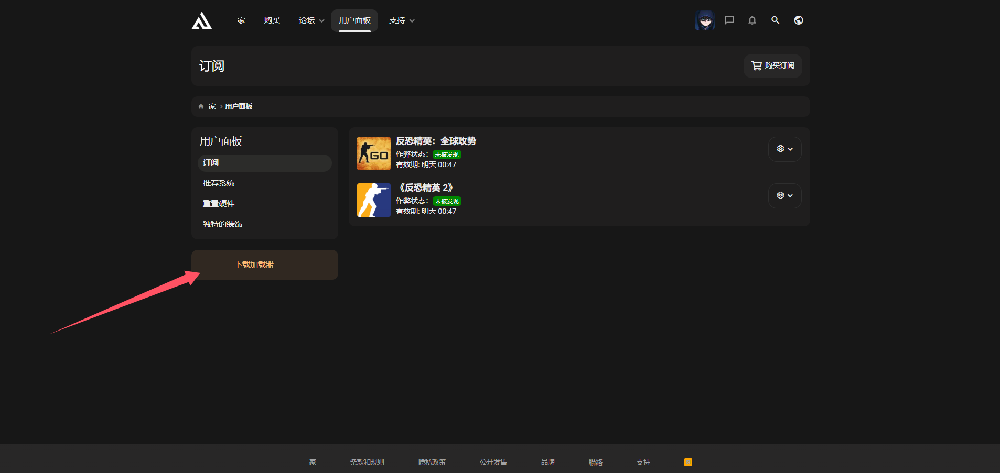

# Nixware续费教程

在续费开始前，请确保您已经注册了Nixware账户。如果您还没有注册，请前往以下链接注册：
[https://nixware.cc/register](https://nixware.cc/register)

## 1. 在Flux HvH™官网购买产品密钥

您可以通过以下链接直接进入Flux HvH™官网续费页面：

[https://cshvh.cn/renewal](https://cshvh.cn/renewal)

在产品选择框中点击 **Nixware (续费码)** 选项，并选择好您所需的订阅时间，如下图所示：

勾选以下承诺框，然后点击您可以使用的付款方式，完成续费码的购买。

支付完成后，您将收到产品密钥，请妥善保存。

---

## 2. 选择合适的语言

进入官网后语言选项卡和购买选项卡如下图所示：

## 3. 进入购买界面激活密钥

前往以下链接重新进入购买页面：  
[https://nixware.cc/purchase-cheats](https://nixware.cc/purchase-cheats/)

找到页面中的 **兑换码** 按钮，激活订阅，如下图所示：

您会看到如下界面，输入您的购买密钥，点击 **兑换** 按钮：

如果您没有显示验证码，请开启加速器。

**至此您已激活相应订阅！**

---

## 4. 下载Loader
激活完成后您的 **用户面板** 会有如图选项。
此时您只需下载Loader后打开即可。

---
完成以上步骤后，您已成功续费并下载其注入器。
如果在操作过程中遇到问题，请联系支持团队以获取帮助！