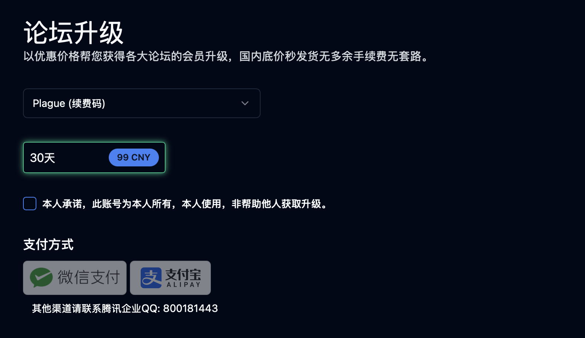
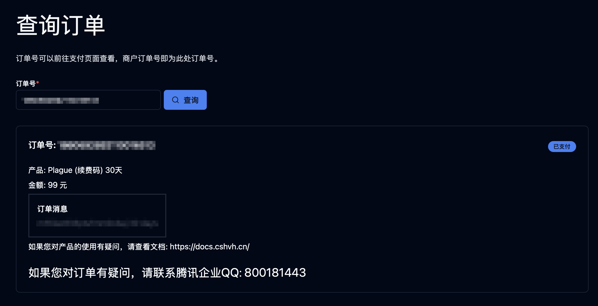
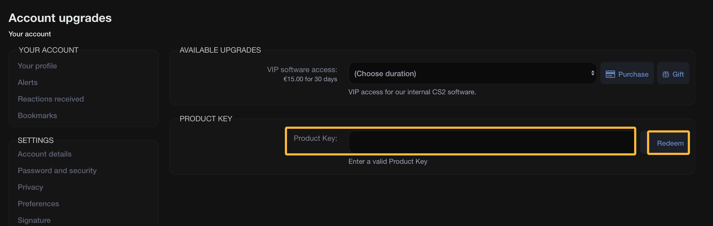
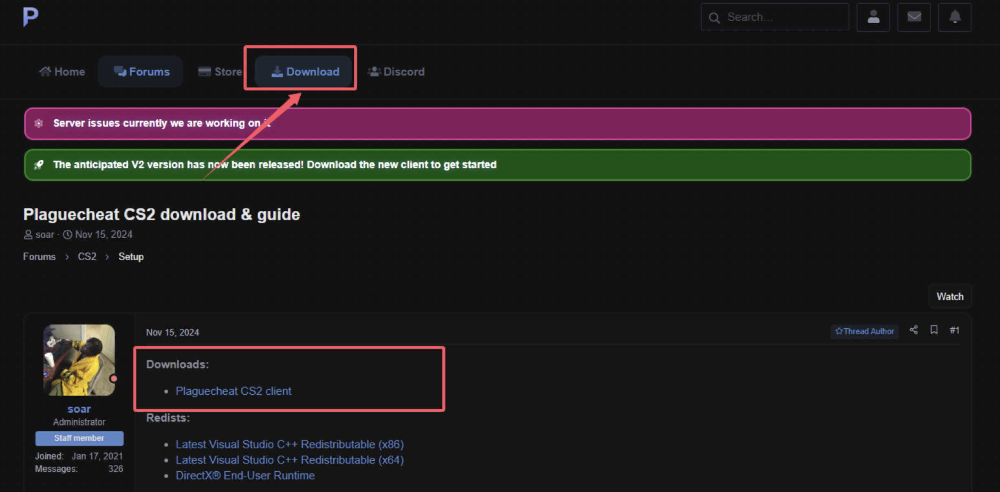

# Plague续费教程

在续费开始前，请确保您已经注册了Plague账户。如果您还没有注册，请前往以下链接注册：
[https://plaguecheat.cc/forum/](https://plaguecheat.cc/forum/)

## 1. 在Flux HvH™官网购买产品密钥

您可以通过以下链接直接进入Flux HvH™官网续费页面：

[https://cshvh.cn/renewal](https://cshvh.cn/renewal)

在产品选择框中点击 **Plague (续费码)** 选项，如下图所示：

勾选以下承诺框，然后点击您可以使用的付款方式，完成邀请码的购买。

支付完成后，您将收到产品密钥，请妥善保存。

---

## 2. 在Plague论坛中激活订阅

前往以下链接进入Plague续费页面：
[https://plaguecheat.cc/forum/index.php?account/upgrades](https://plaguecheat.cc/forum/index.php?account/upgrades)

您需要在以下输入框中输入您购买的产品密钥，然后点击 **Redeem** 按钮，如下图所示：

至此，您的Plague已经激活。

---

## 3. 下载Loader
在论坛中找到 **Download** 板块，点击下载 Loader，如下图所示：

完成以上步骤后，您已成功续费。
如果在操作过程中遇到问题，请联系支持团队以获取帮助！